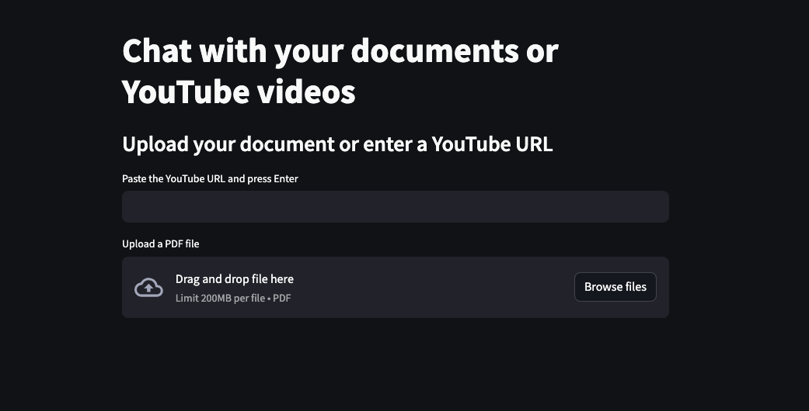
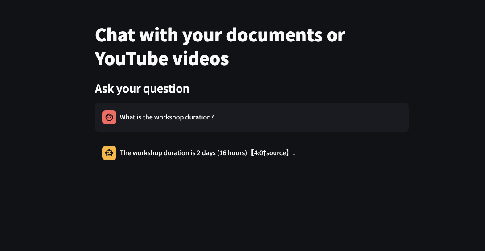

# blog_streamlit_assistant

This example application demonstrates how to build an AI chatbot using YouTube and PDF files with the OpenAI Assistant API and Streamlit.

This application was created as an example for a blog post: TODO the url

## Setup

1. Install Python (3.12) and Poetry.
1. Run `poetry install`.
1. Set your OpenAI API key in the `.env` file.
1. Run `poetry run streamlit run run.py` (or use the Visual Studio configuration in `.vscode/launch.json`).

## Limitations

* No user authentication.
* One assistant and one vector store for all chats.